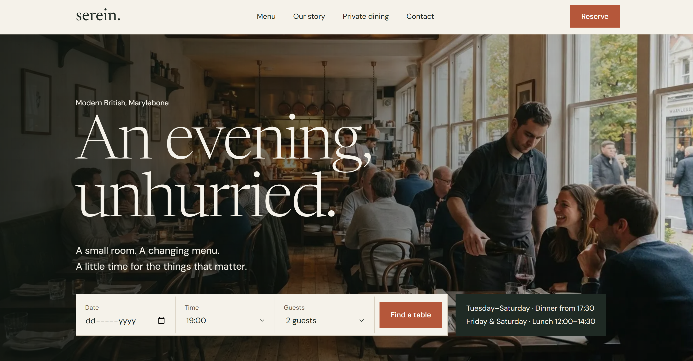

# Serein

A booking-first website concept for a fictional 38-seat modern British restaurant in Marylebone, London. Designed in Figma, built with React and Tailwind CSS.

**Live demo:** https://serein-restaurant-demo.vercel.app/



> **Concept project.** The restaurant, press quotes, suppliers, reviews, phone number and email are fictional. Photography is AI-generated placeholder imagery. The booking and newsletter forms are front-end demos with no backend.

## Why this project

Many small restaurant sites make booking harder than it should be: menus buried in PDFs, a reservation link hidden in the footer, layouts that break on a phone, and copy that sounds like every other "fine dining experience". This concept explores the opposite: a site that feels like a real neighbourhood restaurant, makes booking the main action, and loads fast on a mid-range phone.

## Features

- **Booking first:** a booking bar in the hero on desktop; on mobile, a sticky "Reserve a table" button that opens a booking dialog. The form is built with React Hook Form, requires a date, and tells guests the restaurant is closed on Sundays and Mondays.
- **Responsive layout:** a full-screen navigation drawer on mobile, a swipeable menu row, and an asymmetric menu grid on desktop.
- **Content sections:** seasonal menu highlights with dietary tags, a chef's note with named suppliers, a reviews strip, private dining with an enquiry link, a gallery, and a location block with opening hours and directions.
- **Accessibility:** semantic HTML, descriptive alt text, visible keyboard focus, labelled form fields, and `prefers-reduced-motion` support.
- **SEO and metadata:** page title and description, Open Graph tags, and `Restaurant` structured data (JSON-LD) with address and opening hours.
- **Light theme only:** the design is intentionally locked to its cream and green palette.

## Performance

Lighthouse, mobile, Slow 4G throttling, Moto G Power emulation:

| Metric | Before | After |
| --- | --- | --- |
| Performance | 82 | **99** |
| Largest Contentful Paint | 4.2 s | **2.0 s** |
| First Contentful Paint | 2.6 s | **1.7 s** |
| Accessibility | 100 | **100** |
| Best Practices | 96 | **100** |
| Cumulative Layout Shift | 0 | **0** |
| Total Blocking Time | 20 ms | **20 ms** |

What changed between the two runs:

- The hero image is served from `public/` as responsive WebP (800 px and 1800 px) and preloaded in `index.html`, so the browser discovers it before the JavaScript loads.
- Google Fonts load without blocking render (`preload` with an `onload` swap and a `noscript` fallback).
- Below-the-fold images use `loading="lazy"`.

The SEO score is lower (63) only because of one flag, "Page is blocked from indexing". That is the deliberate `noindex` meta tag, added so a fictional restaurant does not appear in search results. All other SEO checks pass.

## Tech stack

- [React](https://react.dev/) 18
- [Vite](https://vitejs.dev/)
- [Tailwind CSS](https://tailwindcss.com/) v4 (design tokens in the `@theme` block of `src/index.css`)
- [React Hook Form](https://react-hook-form.com/)
- [sharp](https://sharp.pixelplumbing.com/) (dev dependency, used to generate the hero WebP files)
- Fonts: Newsreader and DM Sans (Google Fonts)
- Hosted on [Vercel](https://vercel.com/)

## Getting started

Requires Node.js 18 or newer.

```bash
npm install
npm run dev       # start the dev server
npm run build     # production build in dist/
npm run preview   # preview the production build locally
```

To regenerate the hero images after changing `src/assets/hero.jpg`:

```bash
node scripts/hero.mjs
```

## Project structure

```
serein/
├── public/              hero-800.webp, hero-1800.webp (preloaded in index.html)
├── scripts/
│   └── hero.mjs         generates the hero WebP sizes with sharp
├── src/
│   ├── assets/          optimised JPEG images used across the page
│   ├── App.jsx          page layout, booking dialog, mobile reserve bar
│   ├── Booking.jsx      reservation form (React Hook Form)
│   ├── Nav.jsx          header and mobile navigation drawer
│   ├── sections.jsx     Hero, Intro, Menu, Chef, Reviews, Private, Gallery, Contact, Footer
│   ├── ui.jsx           shared building blocks (buttons, section wrapper, headings)
│   ├── data.js          copy, dishes, suppliers, reviews and image imports
│   ├── index.css        Tailwind import and design tokens
│   └── main.jsx
├── index.html           meta tags, structured data, preloads
└── vite.config.js
```

All copy and image references live in `src/data.js`, so the content can be swapped for a real restaurant without touching the components.

## What a real client project would add

- A real booking system (for example OpenTable or ResDiary) connected to the form
- A professional photo shoot instead of placeholder imagery
- A CMS for the weekly menu
- A full menu page and a proper map embed
- Analytics and an email provider for the newsletter